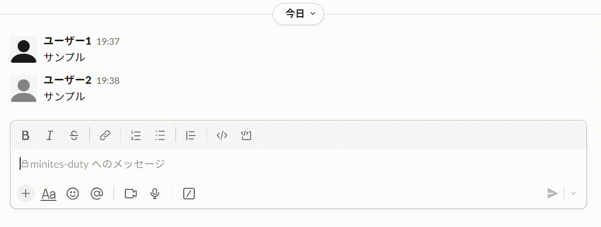

# 議事録当番の通知SlackBot
## 1. 概要

会議の1日前になると、議事録の記録担当者に議事録ドキュメントを準備するよう通知を送信するBot。週に1回の会議の議事録の当番を、複数名のチームメンバーで交代で担当することを想定している。

## 2. 動作環境

- Ubuntu 22.04 LTS
- Python 3.10.12
  - slack-bolt 1.18.0
  - slackbot 1.0.5

## 3. Slackアプリの設定方法

本章では、Slackアプリの作成、設定方法について説明する。

### 3.1 Slackアプリの作成

1. [Slack APIの"Your Apps"](https://api.slack.com/apps)から"Create New App"を選択
2. "From scratch"を選択し、任意の名前を設定する
3. 作成したアプリを開き、"Basic Information"の"Display Information"は任意の名前、アイコンを設定
4. ソケットモードでSlackアプリを使用するので、"Socket Mode"の"Enable Socket Mode"をONにする

### 3.2 スコープ及びイベントサブスクリプションの設定

1. "OAuth & Permissions"の"Bot Token Scopes"から、以下をスコープに追加
   - `chat:write`
   - `chat:write.customize`
   - `groups:read`
   - `groups:write`
2. "Event Subscriptions"の"Subscribe to bot events"から、以下を追加
   - `app_mention`
   - `message.channels`
   - `message.groups`
   - `message.im`
   - `message.mpim`
3. "Basic Information"の"App-Level Tokens"から、"Generate Token and Scopes"を選択。トークン名は任意の名前で、スコープは`connections:write`を追加


### 3.3 スラッシュコマンドの追加

"Slash Commands"の"Create new comamd"で、以下の4種類のコマンドを追加。

- `/echo`
- `/adduser`
- `/schedule`
- `/setdate`

### 3.4 アプリのインストール

1. "Install App"から、"Reinstall to Workspace"を選択
2. Slackアプリを起動し、本アプリをインストールしたいチャンネルの「インテグレーション」から追加する

## 4. 環境構築

本章では環境構築の方法について述べる。4.1もしくは4.2のいずれかの手順を、本アプリを使用したい環境に応じて実施する。

### 4.1 Ubuntuマシンに直接インストールする方法

以下のコマンドを実行する。Docker環境を使用する場合は本内容をスキップして問題ない。

```bash
$ pip3 install --upgrade pip
$ pip3 install slackbot slack_bolt
```

### 4.2 Docker環境を使用する方法

あらかじめ、[Dockerfile](Dockerfile)の配置されたディレクトリに`.env`という名前のファイルを作成し、Slackアプリの"OAuth & Permissions"に記載されている"Bot User OAuth Token"、及び3.2節の3.で作成した"App-Level Token"を記載しておく。

```bash
SLACK_BOT_TOKEN=xoxb-XXXXXX...   # Bot User OAuth Token
SLACK_APP_TOKEN=xapp-XXXXXX...   # App-Level Token
```

以下のコマンドを実行する。Ubuntuマシンに直接インストールする場合は本内容をスキップして問題ない。

```bash
$ docker-compose build
$ docker-compose up -d
```

## 5. Botの起動方法

crontabを使用する場合の設定例を以下に示す。[run.py](run.py)はBotの起動スクリプト、[notice_and_update.py](notice_and_update.py)は議事録当番の通知および会議日時の更新スクリプトである。

[run.py](run.py)はオプション引数は不要で、[notice_and_update.py](notice_and_update.py)は第1引数に通知を投稿したいチャンネル名を、第2引数に会議日時の周期を日単位で指定する。

crontabを使用する場合は、pythonスクリプトを実行できるよう環境変数`PATH`と、Slackアプリの"OAuth & Permissions"に記載されている"Bot User OAuth Token"及び3.2節の3.で作成した"App-Level Token"を記載する必要がある。

```bash
PATH=/usr/local/sbin:/usr/local/bin:/usr/sbin:/usr/bin:/sbin:/bin
SLACK_BOT_TOKEN=xoxb-XXXXXX...   # Bot User OAuth Token
SLACK_APP_TOKEN=xapp-XXXXXX...   # App-Level Token

@reboot python3 /app/run.py                                   # サーバーの起動時に本Botを起動
00 20 * * * python3 /app/notice_and_update.py minites-duty 7  # 毎日20時00分に実行
```

## 6. 会議日程・参加メンバーの設定方法

Slack内で以下のコマンドを実行。

```bash
# 1. 会議メンバーの追加(人数制限なし)
/adduser @ユーザー1 @ユーザー2 @ユーザー3

# 2. 1回目の会議日を設定(1.の実行後に行う)
/schedule YYYY/mm/dd

# 3. 会議日時の変更(第1引数が変更前の日時、第2引数が変更後の日時)
/setdate 2023/08/13 2023/08/15

# 4. 設定内容の表示
/echo
```

コマンドの実行例



毎日20時に[notice_and_update.py](notice_and_update.py)を実行し、もし翌日に会議が設定されていれば議事録の担当者に通知する。


